  

  
  

## 👋 Sobre mim

Sou desenvolvedor full stack em Belo Horizonte. No back-end, trabalho com **C# e .NET**: APIs REST, Entity Framework Core, arquitetura em camadas e testes rodando contra banco de verdade. No front-end, uso **Angular** em aplicações completas e **React/Next.js com GSAP** quando o projeto pede movimento e uma experiência mais criativa. Nas horas vagas, exploro **IA rodando 100% local**.

- 🔭 **Agora:** construindo o [Cartola Várzea](https://github.com/pedromeireles23/cartola-varzea), um fantasy game para campeonatos amadores de futebol.
- 🧠 **Explorando:** assistentes de IA locais com llama.cpp no [Segundo Cérebro IA](https://github.com/pedromeireles23/segundo-cerebro-ia).
- 🎮 **Por hobby:** planejando um RPG de ação em Unity 6, [*O Chamado da Torre*](https://github.com/pedromeireles23/jogo).
- 📚 **Praticando:** algoritmos em C# com [Project Euler](https://github.com/pedromeireles23/ProjectEuler) e [Rosetta Code](https://github.com/pedromeireles23/RosettaCode).

## 🚀 Projetos em destaque

<table>
<tr>
<td width="50%" valign="top">

### ⚽ [Cartola Várzea](https://github.com/pedromeireles23/cartola-varzea)

Fantasy game para campeonatos amadores (Fut7, futsal e campo): organizadores lançam súmulas, participantes montam times e disputam ligas. Monólito modular com ADRs, CI e **680+ testes**, incluindo integração com SQL Server real e E2E com Playwright.

`.NET 10` `Angular 22` `SQL Server` `Docker` `Azure`

</td>
<td width="50%" valign="top">

### 🧠 [Segundo Cérebro IA](https://github.com/pedromeireles23/segundo-cerebro-ia)

Assistente de IA 100% local que usa um vault do Obsidian como memória de longo prazo: curadoria automática de notas, *council* com múltiplas personas e agente de código com *tool calling*.

`Python` `llama.cpp` `Obsidian` `LLMs locais`

</td>
</tr>
<tr>
<td width="50%" valign="top">

### 🌳 [Floresta Viva](https://github.com/pedromeireles23/site-creativo)

Experiência digital artística e cinematográfica sobre a Amazônia, com animações guiadas pelo scroll.

`Next.js` `TypeScript` `GSAP` `Lenis` `SCSS`

[**Ver online ↗**](https://floresta-viva-experiencia.vercel.app)

</td>
<td width="50%" valign="top">

### 🎯 [Arquivo de Lendas](https://github.com/pedromeireles23/apexwebsite)

Arquivo interativo das Lendas de *Apex Legends*, com pôsteres animados, transições cinematográficas e dossiês de cada personagem. Responsivo e com suporte a movimento reduzido.

`Next.js` `React` `TypeScript`

[**Ver online ↗**](https://arquivo-de-lendas.vercel.app)

</td>
</tr>
<tr>
<td width="50%" valign="top">

### ✅ [TaskManager API](https://github.com/pedromeireles23/ApiGestaoTarefas)

API REST multi-tenant no estilo Trello/Asana: workspaces, projetos e tarefas isolados por empresa via filtro global do EF Core, JWT com refresh token e papéis Admin, Member e Viewer.

`.NET 10` `Minimal APIs` `EF Core` `PostgreSQL` `Testcontainers`

</td>
<td width="50%" valign="top">

### 📊 [FinanceProcessor](https://github.com/pedromeireles23/Processador-de-Dados-Financeiros)

CLI que lê extratos bancários em CSV e gera relatórios financeiros. A mesma leitura é implementada do jeito ingênuo ao otimizado e medida com benchmarks.

`C#` `.NET` `Span<T>` `BenchmarkDotNet`

</td>
</tr>
</table>

## 🛠️ Tecnologias

<table>
  <tr>
    <td><b>Linguagens</b></td>
    <td>
      
      
      
      
      
      
      
      
      
    </td>
  </tr>
  <tr>
    <td><b>Back-end</b></td>
    <td>
      
      
      
      
      
      
    </td>
  </tr>
  <tr>
    <td><b>Front-end</b></td>
    <td>
      
      
      
      
      
      
      
    </td>
  </tr>
  <tr>
    <td><b>Bancos de dados</b></td>
    <td>
      
      
    </td>
  </tr>
  <tr>
    <td><b>Testes</b></td>
    <td>
      
      
      
    </td>
  </tr>
  <tr>
    <td><b>DevOps & Cloud</b></td>
    <td>
      
      
      
      
      
    </td>
  </tr>
  <tr>
    <td><b>IA & outros</b></td>
    <td>
      
      
      
    </td>
  </tr>
</table>

## 🕒 Atividade recente

<!-- RECENT_REPOS:START -->
| Repositório | Descrição | Linguagem | Atualizado |
|---|---|:---:|:---:|
| [**cartola-varzea**](https://github.com/pedromeireles23/cartola-varzea) | ⚽ Fantasy game para campeonatos amadores de futebol (Fut7, futsal e campo) — .NET 10, Angular 22 e SQL Server. | `C#` | 03/10/2026 |
| [**site-creativo**](https://github.com/pedromeireles23/site-creativo) | 🌳 Floresta Viva — experiência digital cinematográfica sobre a Amazônia, com Next.js, GSAP e Lenis. · [🔗 demo](https://floresta-viva-experiencia.vercel.app) | `TypeScript` | 01/10/2026 |
| [**segundo-cerebro-ia**](https://github.com/pedromeireles23/segundo-cerebro-ia) | 🧠 Assistente de IA 100% local (llama.cpp) com memória de longo prazo em um vault Obsidian: curadoria… | `Python` | 01/10/2026 |
| [**apexwebsite**](https://github.com/pedromeireles23/apexwebsite) | 🎯 Arquivo de Lendas — arquivo interativo das Lendas de Apex Legends, feito com Next.js e TypeScript. · [🔗 demo](https://arquivo-de-lendas.vercel.app) | `TypeScript` | 23/09/2026 |
| [**jogo**](https://github.com/pedromeireles23/jogo) | 🎮 O Chamado da Torre — RPG de ação em fantasia medieval feito em Unity 6 (em desenvolvimento). | — | 19/09/2026 |
| [**portfolio-new**](https://github.com/pedromeireles23/portfolio-new) | Novo portfólio pessoal com Next.js, MDX, GSAP e Lenis (em construção). | `CSS` | 31/08/2026 |
<!-- RECENT_REPOS:END -->

Lista atualizada automaticamente todos os dias por um [GitHub Action](.github/workflows/update-readme.yml).

## 📫 Contato

Fique à vontade para me chamar para trocar ideias sobre projetos, código ou oportunidades.

